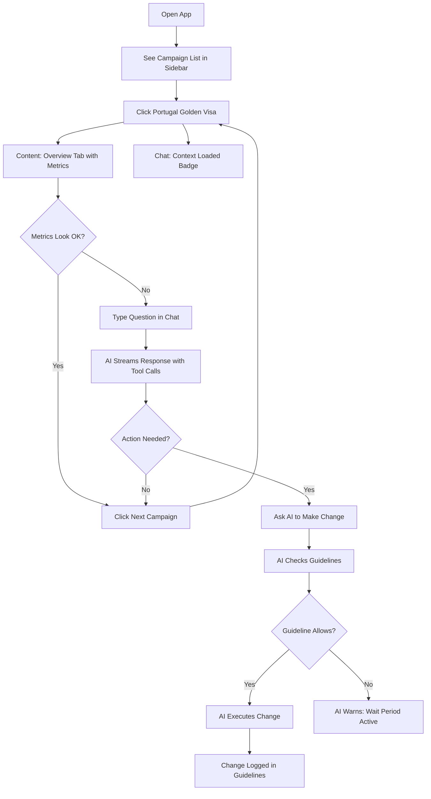
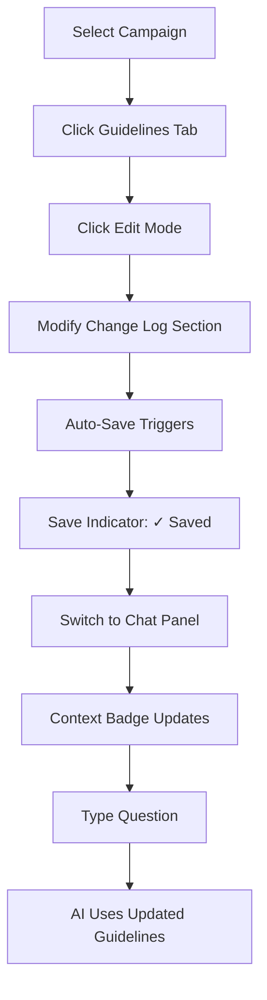
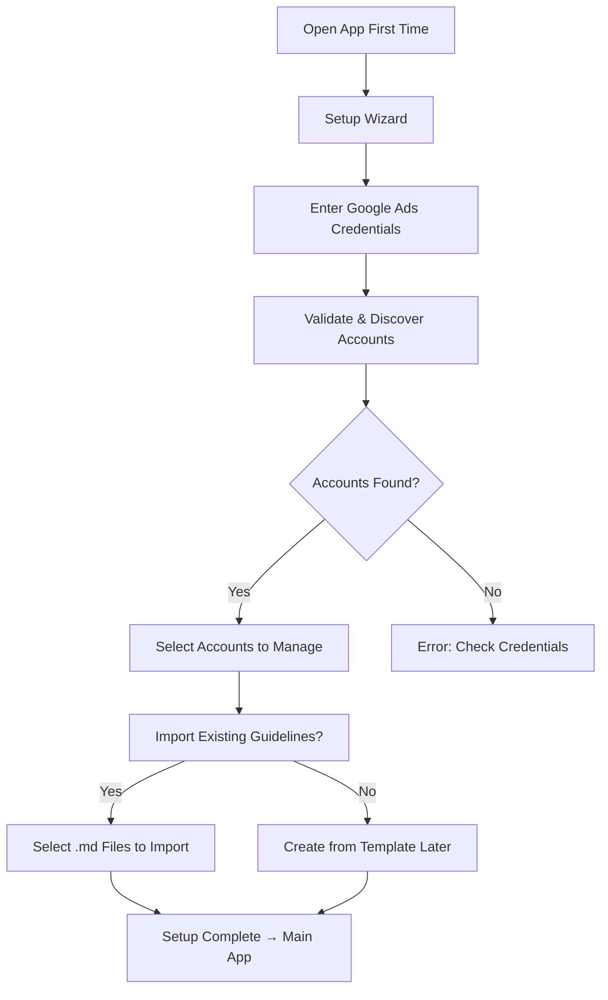

# UX Design Specification - Google Ads Campaign Manager

**Author:** Wassim
**Date:** 2026-03-26
**Version:** 1.0
**Status:** Complete

---

## 1. Executive Summary

### Project Vision

A local web application that serves as a purpose-built command center for Google Ads campaign management. The application combines a visual campaign browser, an AI agent chat panel, and a campaign guidelines editor into a unified workspace that replaces Claude Desktop for daily campaign operations.

### Target Users

**Primary User: Campaign Manager (Wassim)**
- Technical proficiency: High (builds MCP servers, writes Python scripts, uses CLI tools)
- Google Ads experience: Active manager of multiple campaigns across regions
- Daily workflow: Review metrics, ask AI questions, make adjustments, update guidelines
- Pain points: Context loss between sessions, no visual overview, manual guideline loading

### Key Design Challenges

1. **Three-panel layout balance** - Campaign browser, content area, and chat panel must coexist without feeling cramped on a single monitor
2. **AI chat as primary, not secondary** - The chat panel must feel like a first-class citizen, not a support widget
3. **Seamless context switching** - Navigating between campaigns should instantly update both the data view and the AI agent's context
4. **Information density** - Google Ads data is inherently dense (many metrics, many rows). The UI must show enough data to be useful without overwhelming
5. **Guidelines integration** - Guidelines must be both readable (formatted view) and editable (markdown editor) with instant context injection

### Design Opportunities

1. **Split-pane workspace** inspired by IDE layouts (VS Code, JetBrains) where users are comfortable with sidebar + editor + panel arrangements
2. **Contextual AI** that visibly adapts when campaigns change (show which guidelines are loaded)
3. **Progressive disclosure** - Show summary metrics in the campaign list, full details on click, deep analysis on AI request
4. **Tool transparency** - Make the AI's MCP tool usage visible and educational, building user trust

---

## 2. Core User Experience

### Defining Experience

The defining experience is: **"Select a campaign, see everything, ask anything."**

The user clicks a campaign in the sidebar. Instantly, the center panel shows campaign details and metrics. The chat panel shows a context indicator ("Portugal Golden Visa guidelines loaded"). The user types a question. The AI responds with full campaign awareness, showing which tools it used. The user never had to say "read the guidelines first" or "the campaign ID is 23636342079."

### Platform Strategy

- **Desktop-first SPA** running on localhost
- Optimized for 1920x1080+ screens (typical developer/marketer monitor)
- Usable at 1366x768 (laptop) with collapsed sidebar
- No mobile layout for MVP (Phase 3 consideration)

### Effortless Interactions

| Interaction | Current (Claude Desktop) | New (Web App) |
|-------------|--------------------------|---------------|
| Switch campaign | Type "let's look at Portugal campaign, ID 23636342079" | Click campaign name in sidebar |
| Load guidelines | "Please read CAMPAIGN_GUIDELINES.md and find the Portugal section" | Auto-loaded on campaign selection |
| Check metrics | "What are the metrics for the last 7 days?" | Visible in the campaign detail panel |
| Make a change | "Change the budget to $250/day" + hope agent reads guidelines first | Type same message, agent already has guidelines |
| Update guidelines | Open a separate editor, edit file, save | Click Guidelines tab, edit inline, auto-save |

### Critical Success Moments

1. **First load** - User sees their accounts and campaigns immediately. No blank screen, no "enter your API key" modal blocking the view.
2. **Campaign selection** - Click → instant context switch. Guidelines loaded indicator visible. Chat ready.
3. **First AI question** - Agent responds with awareness of campaign rules. User realizes they don't need to re-explain context.
4. **Tool transparency** - User sees "Agent used: get_campaign_metrics, get_search_terms" and can expand to see what happened. Trust builds.
5. **Guidelines edit → AI awareness** - User updates a guideline, sends a chat message, agent uses the updated rule. The loop is closed.

### Experience Principles

1. **Context is king** - Every panel knows which campaign is selected. Navigation state is global.
2. **Show, don't ask** - Display data proactively. Don't make users request information the app already has.
3. **AI is a peer, not a tool** - The chat panel is a conversation with a knowledgeable colleague, not a command prompt.
4. **Transparency builds trust** - Show what the AI is doing (tool calls, context loaded, reasoning).
5. **Respect the power user** - Don't hide complexity behind wizards. Show data density, support keyboard shortcuts, allow direct operations.

---

## 3. Desired Emotional Response

### Primary Emotional Goals

| Emotion | Description | Design Implication |
|---------|-------------|-------------------|
| **Control** | "I can see everything about my campaigns at a glance" | Dense but organized data display, no hidden pages |
| **Confidence** | "The AI knows my campaign rules and won't make mistakes" | Visible context indicators, guidelines loaded badge |
| **Efficiency** | "I just did in 2 minutes what used to take 15" | Minimal clicks, auto-context, persistent state |
| **Trust** | "I can see exactly what the AI did and why" | Tool call transparency, expandable details |

### Emotional Journey Mapping

```
First Session:
  Setup wizard → Relief (easy) → Account loads → Excitement (it works!)
  → Click campaign → Surprise (everything is here) → Ask AI → Delight (it knows my rules)

Daily Usage:
  Open app → Familiarity (same state) → Scan metrics → Confidence (nothing broken)
  → Chat with AI → Efficiency (fast answers) → Update guidelines → Satisfaction (loop closed)

Issue Discovery:
  See metric drop → Concern → Ask AI for analysis → Understanding (clear explanation)
  → AI suggests fix → Trust (follows guidelines) → Approve change → Relief (handled)
```

### Micro-Emotions

- **Campaign selection click:** Satisfaction of instant context switch (no loading spinner for cached data)
- **AI streaming response:** Engagement as tokens appear (not waiting for a wall of text)
- **Tool call expansion:** Curiosity satisfied (seeing what happened under the hood)
- **Guidelines save:** Reassurance via visual confirmation (subtle save indicator)
- **Error from Google Ads API:** Not anxiety - the error message is clear and actionable

---

## 4. UX Pattern Analysis & Inspiration

### Inspiring Products Analysis

| Product | What to Borrow | What to Avoid |
|---------|----------------|---------------|
| **VS Code** | Sidebar + Editor + Panel layout, command palette, split panes | Over-complexity of settings, extension overload |
| **Linear** | Clean data tables, keyboard navigation, fast interactions | Over-minimalism that hides useful information |
| **ChatGPT** | Chat interface patterns, streaming responses, message formatting | Generic chat feel without contextual awareness |
| **Google Ads UI** | Metric display patterns, campaign hierarchy navigation | Overwhelming menus, slow load times, too many tabs |
| **Grafana** | Dashboard layout, date range picker, metric cards | Dashboard-only approach (we need chat + data) |

### Transferable UX Patterns

1. **IDE Three-Panel Layout** (from VS Code)
   - Left: Navigation sidebar (collapsible)
   - Center: Content area (campaign details, guidelines editor)
   - Right: Chat panel (resizable)

2. **Command-K Navigation** (from Linear/Raycast)
   - Quick search/command palette for fast campaign switching
   - Keyboard-first for power users

3. **Streaming Chat with Tool Calls** (from Claude Desktop / ChatGPT)
   - Token-by-token streaming
   - Collapsible tool call blocks between messages
   - Markdown rendering in responses

4. **Metric Cards + Data Tables** (from Google Ads / Grafana)
   - Key metrics as cards at the top of campaign view
   - Sortable, filterable tables for keywords, ads, search terms

### Anti-Patterns to Avoid

- **Dashboard-first design** - Don't bury the chat behind a dashboard. Chat is the primary interaction.
- **Wizard flows for operations** - Don't force multi-step forms for campaign changes. Let users ask the AI.
- **Modal dialogs** - Don't block the workspace with modals. Use inline panels and slide-overs.
- **Tab overload** - Don't recreate Google Ads' 15-tab structure. Use a focused set of views.
- **Loading spinners on cached data** - Show cached data immediately, refresh in background.

---

## 5. Design System Foundation

### Design System Choice

**Tailwind CSS + shadcn/ui components**

### Rationale

| Criterion | Decision |
|-----------|----------|
| Component library | shadcn/ui - copy-paste components, fully customizable, TypeScript-native |
| Styling approach | Tailwind CSS - utility-first, consistent spacing/colors, no CSS file management |
| Icons | Lucide React - clean, consistent, lightweight |
| Charts | Recharts - React-native, composable, good for time-series data |
| Markdown | MDXEditor or @uiw/react-md-editor - feature-rich markdown editing |
| Tables | TanStack Table + shadcn/ui DataTable - virtual scrolling, sorting, filtering |

### Why shadcn/ui Over Full Component Libraries

- **No dependency lock-in** - Components are copied into the project, not imported from node_modules
- **Full customization** - Every component can be modified without fighting a library's opinion
- **Tailwind-native** - Built on Tailwind + Radix UI primitives
- **Excellent defaults** - Clean, professional look out of the box
- **Active community** - Well-maintained, frequently updated

### Customization Strategy

The base shadcn/ui theme will be customized for:
- Google Ads-aligned color palette (performance indicators: green/yellow/red for metrics)
- Higher information density than default (tighter padding for data-heavy views)
- Custom chat components (streaming, tool calls, context indicators)

---

## 6. Visual Design Foundation

### Color System

**Base Theme: Dark mode default, light mode supported**

Rationale: Power users managing ads often work in low-light environments. Dark mode reduces eye strain during extended sessions. Light mode available for preference.

**Semantic Colors:**

| Token | Dark Mode | Light Mode | Usage |
|-------|-----------|------------|-------|
| `--background` | `hsl(224, 71%, 4%)` | `hsl(0, 0%, 100%)` | Page background |
| `--card` | `hsl(224, 71%, 6%)` | `hsl(0, 0%, 100%)` | Cards, panels |
| `--sidebar` | `hsl(224, 71%, 5%)` | `hsl(210, 40%, 98%)` | Sidebar background |
| `--primary` | `hsl(217, 91%, 60%)` | `hsl(217, 91%, 50%)` | Primary actions, links |
| `--accent` | `hsl(217, 33%, 17%)` | `hsl(210, 40%, 96%)` | Hover states, selected items |
| `--muted` | `hsl(215, 20%, 65%)` | `hsl(215, 16%, 47%)` | Secondary text |
| `--border` | `hsl(217, 33%, 17%)` | `hsl(214, 32%, 91%)` | Borders, dividers |

**Status/Metric Colors:**

| Token | Color | Usage |
|-------|-------|-------|
| `--status-enabled` | `hsl(142, 71%, 45%)` | Campaign/ad enabled, positive metrics |
| `--status-paused` | `hsl(38, 92%, 50%)` | Paused items, warning metrics |
| `--status-removed` | `hsl(0, 84%, 60%)` | Removed items, negative metrics |
| `--metric-positive` | `hsl(142, 71%, 45%)` | Metric improvement (green) |
| `--metric-negative` | `hsl(0, 84%, 60%)` | Metric decline (red) |
| `--metric-neutral` | `hsl(215, 20%, 65%)` | No change |

**Chat-Specific Colors:**

| Token | Color | Usage |
|-------|-------|-------|
| `--chat-user` | `hsl(217, 91%, 60%)` | User message bubble |
| `--chat-assistant` | `hsl(224, 71%, 8%)` | Assistant message background |
| `--chat-tool-api` | `hsl(280, 65%, 60%)` | Google Ads API tool call indicator (purple) |
| `--chat-tool-browser` | `hsl(172, 66%, 50%)` | Chrome browser tool call indicator (teal) |
| `--chat-context` | `hsl(142, 50%, 20%)` | Context loaded badge |

### Typography System

| Element | Font | Size | Weight | Line Height |
|---------|------|------|--------|-------------|
| **Body** | Inter | 14px | 400 | 1.5 |
| **Body Small** | Inter | 13px | 400 | 1.4 |
| **H1 (Page Title)** | Inter | 24px | 600 | 1.2 |
| **H2 (Section)** | Inter | 18px | 600 | 1.3 |
| **H3 (Subsection)** | Inter | 15px | 600 | 1.3 |
| **Label** | Inter | 12px | 500 | 1.4 |
| **Metric Value** | Inter | 20px | 700 | 1.0 |
| **Metric Label** | Inter | 11px | 500 | 1.4 |
| **Code/Tool Call** | JetBrains Mono | 13px | 400 | 1.5 |
| **Chat Message** | Inter | 14px | 400 | 1.6 |
| **Markdown (Guidelines)** | Inter | 14px | 400 | 1.7 |

### Spacing & Layout Foundation

**Spacing Scale (Tailwind defaults):**
- `space-1`: 4px (tight padding, icon gaps)
- `space-2`: 8px (standard padding)
- `space-3`: 12px (card padding)
- `space-4`: 16px (section spacing)
- `space-6`: 24px (panel gaps)
- `space-8`: 32px (major section spacing)

**Layout Grid:**
- Sidebar: 280px (collapsible to 48px icon-only)
- Chat panel: 400px default (resizable, min 320px, max 600px)
- Content area: fills remaining space (min 500px)
- Total minimum viewport: 1100px

---

## 7. Application Layout

### Primary Layout: Three-Panel Workspace

```
+-----------------------------------------------------------+
| Header Bar (48px)                                          |
| [Logo] [Account Selector ▼] [Search (Cmd+K)]   [Settings] |
+----------+---------------------------+--------------------+
|          |                           |                    |
| Sidebar  |    Content Area           |    Chat Panel      |
| (280px)  |    (flexible)             |    (400px)         |
|          |                           |                    |
| Accounts |  Campaign Detail View     | [Context Badge]    |
|  └ Mercan|  ┌──────────────────┐     |                    |
|    └ PGV |  │ Metric Cards     │     | Chat messages...   |
|    └ GRE |  │ $200 │ 45 │ 3   │     |                    |
|    └ MENA|  └──────────────────┘     | [AI]: Based on     |
|          |                           | your guidelines... |
| Campaigns|  ┌──────────────────┐     |                    |
|  ● PGV   |  │ Tab Bar:         │     | > Tool: get_camp...|
|  ● Greece|  │ [Overview][KWs]  │     |   {result...}      |
|  ○ MENA  |  │ [Ads][Guidelines]│     |                    |
|          |  │                  │     |                    |
|          |  │ Content...       │     |                    |
|          |  │                  │     |                    |
|          |  └──────────────────┘     | ┌────────────────┐ |
|          |                           | │ Type message... │ |
+----------+---------------------------+--------------------+
```

### Header Bar (48px height)

- **Left:** App logo/name ("Google Ads Manager")
- **Center-Left:** Account selector dropdown (shows current: "Mercan Group Main Account")
- **Center:** Quick search / Command palette trigger (Cmd+K)
- **Right:** Settings gear icon, theme toggle (dark/light)

### Sidebar (280px, collapsible)

**Structure:**
```
Campaign Navigation
├── Account Name (clickable → account overview)
│   ├── ● Campaign 1 (● = enabled, ○ = paused)
│   │     Status dot + Name + Budget chip
│   ├── ● Campaign 2
│   └── ○ Campaign 3 (dimmed)
│
├── [+ New Campaign] button
└── [Collapse ◀] at bottom
```

**Behaviors:**
- Click campaign → content area updates + chat context loads
- Active campaign highlighted with accent background
- Status indicators: green dot (enabled), yellow dot (paused), red dot (removed)
- Inline budget chip: "$200/d"
- Collapse to 48px icon-only rail on small screens or user preference
- Filter/search at top of sidebar

### Content Area (Flexible Width)

**Campaign Detail View - Tab Bar:**

| Tab | Content |
|-----|---------|
| **Overview** | Metric cards + campaign settings + ad group tree |
| **Keywords** | Full keyword table with metrics, sortable/filterable |
| **Ads** | Ad list with asset preview and metrics |
| **Guidelines** | Markdown viewer/editor for campaign guidelines |

**Overview Tab Layout:**
```
┌─────────────────────────────────────────────┐
│ Metric Cards (date range selector right)    │
│ ┌────┐ ┌────┐ ┌────┐ ┌────┐ ┌────┐ ┌────┐ │
│ │Impr│ │Clk │ │CTR │ │Cost│ │Conv│ │CPA │ │
│ │12K │ │450 │ │3.7%│ │$1.2K│ │15 │ │$82│ │
│ │+12%│ │+8% │ │-2% │ │+5% │ │+20%│ │-12%│ │
│ └────┘ └────┘ └────┘ └────┘ └────┘ └────┘ │
├─────────────────────────────────────────────┤
│ Campaign Settings                            │
│ Status: ENABLED  Budget: $200/day            │
│ Bidding: Maximize Clicks (max CPC $8.00)     │
│ Location: United States  Language: English    │
│ Conversion: PGV LP - CT (PRIMARY)            │
├─────────────────────────────────────────────┤
│ Ad Groups                                    │
│ ├── Portugal Golden Visa (7 KWs, 2 Ads)     │
│ │     Clicks: 58  Conv: 6  CPA: $12.50      │
│ ├── Portugal Residency (7 KWs, 2 Ads)       │
│ │     Clicks: 49  Conv: 4  CPA: $15.00      │
│ └── Mercan Brand (4 KWs, 1 Ad)              │
│       Clicks: 12  Conv: 1  CPA: $8.00       │
└─────────────────────────────────────────────┘
```

**Guidelines Tab Layout:**
```
┌─────────────────────────────────────────────┐
│ [View] [Edit]  [Auto-save: ✓ Saved]         │
├─────────────────────────────────────────────┤
│ # Campaign: Portugal Golden Visa             │
│                                              │
│ ## Overview                                  │
│ | Field | Value |                            │
│ | Budget | $200/day |                        │
│ | Bidding | Maximize Clicks |                │
│                                              │
│ ## Conversion Tracking                       │
│ | Action | Role | Status |                   │
│ | PGV LP - CT | PRIMARY | ENABLED |          │
│                                              │
│ ## Change Log                                │
│ | Date | Change | Reason | Impact |          │
│ | 2026-03-19 | Bidding → Max Clicks | ... |  │
│                                              │
│ (Full markdown rendering with tables)        │
└─────────────────────────────────────────────┘
```

### Chat Panel (400px, resizable)

**Layout:**
```
┌────────────────────────────┐
│ Context Bar                │
│ 📋 Portugal Golden Visa    │
│ Guidelines loaded (v3/19)  │
├────────────────────────────┤
│                            │
│ Chat History               │
│                            │
│ [User]: Check conversions  │
│ since March 19             │
│                            │
│ [AI]: I'll check the PGV   │
│ LP-CT conversion data...   │
│                            │
│ 🔧 get_campaign_metrics    │
│   customer_id: 7178239091  │
│   campaign_id: 23636342079 │
│   → 3 conversions ✓        │
│                            │
│ 🌐 navigate                │
│   → tagmanager.google.com  │
│   → GTM container loaded ✓ │
│                            │
│ Based on the data, PGV     │
│ LP-CT has recorded 3       │
│ conversions since the fix. │
│ This is a good sign...     │
│                            │
├────────────────────────────┤
│ ┌────────────────────────┐ │
│ │ Ask about this         │ │
│ │ campaign...            │ │
│ │                    [⏎] │ │
│ └────────────────────────┘ │
│ [New Thread] [Confirm Mode]│
└────────────────────────────┘
```

**Context Bar (top of chat):**
- Shows currently selected campaign name
- "Guidelines loaded" badge with last-modified date
- Click to expand → see which guidelines sections are injected

**Tool Call Blocks:**
- Collapsed by default (show tool name + brief result)
- Click to expand → see full input parameters and output
- **API tool calls** (Google Ads MCP): Purple accent color, wrench icon
- **Browser tool calls** (Chrome MCP): Blue-green accent color, globe/browser icon (🌐)
- Checkmark/X for success/failure
- Browser actions show the URL being navigated to as a subtitle

**Input Area:**
- Multi-line text input (auto-expands up to 4 lines)
- Enter to send, Shift+Enter for new line
- Placeholder: "Ask about this campaign..."
- Bottom bar: [New Thread] button, [Confirm Mode] toggle

---

## 8. User Journey Flows

### Journey 1: Daily Campaign Review



### Journey 2: Guidelines Edit → AI Context Update



### Journey 3: First-Time Setup



### Journey Patterns

- **Context always follows selection** - Every campaign click updates all panels
- **Chat is always available** - Chat panel never disappears; it adapts its context
- **Guidelines are always accessible** - One tab away from any campaign view
- **Operations flow through AI** - Complex changes go through chat; simple views are direct UI

---

## 9. Component Strategy

### Design System Components (from shadcn/ui)

| Component | Usage | Customization |
|-----------|-------|---------------|
| `Button` | Actions, navigation | Size variants: sm for toolbar, default for actions |
| `Card` | Metric cards, campaign cards | Custom padding for dense data |
| `Dialog` | Setup wizard, confirmations | Minimal use - prefer inline |
| `DropdownMenu` | Account selector, context menus | Custom trigger styling |
| `Input` | Search, form fields | With icon prefix support |
| `ScrollArea` | Sidebar, chat history, tables | Custom scrollbar styling |
| `Select` | Date range, filters | Compact variant for toolbars |
| `Separator` | Panel dividers | Subtle in dark mode |
| `Sheet` | Mobile sidebar, settings panel | Right-side sheet for settings |
| `Table` | Keywords, ads, search terms | Dense variant with sorting |
| `Tabs` | Campaign detail tabs | Underline style |
| `Textarea` | Chat input, guidelines editor | Auto-resize for chat |
| `Tooltip` | Metric explanations, truncated text | Dark tooltip on dark theme |
| `Badge` | Status indicators, context loaded | Custom color variants |
| `Collapsible` | Tool call blocks, ad group tree | Animated expand/collapse |

### Custom Components (App-Specific)

| Component | Description | Key Props |
|-----------|-------------|-----------|
| `CampaignSidebar` | Campaign tree navigation with status dots and budget chips | accounts, selectedCampaign, onSelect |
| `MetricCard` | Single metric with value, label, and trend indicator | value, label, trend, trendDirection |
| `MetricCardRow` | Horizontal row of MetricCards for campaign overview | metrics[], dateRange |
| `ChatPanel` | Full chat interface with context bar, messages, input | campaignId, guidelines, onSend |
| `ChatMessage` | Individual message (user or assistant) with markdown rendering | role, content, toolCalls? |
| `ToolCallBlock` | Collapsible tool invocation display with source-aware styling | toolName, source (api/browser), input, output, status |
| `ContextBadge` | Shows loaded guidelines status in chat panel | campaignName, guidelinesLastModified |
| `GuidelinesEditor` | Dual-mode (view/edit) markdown component | content, onChange, readOnly |
| `CampaignDetailTabs` | Tab bar for Overview/Keywords/Ads/Guidelines | campaign, activeTab |
| `AdGroupTree` | Expandable tree of ad groups with metrics | adGroups[], onExpand |
| `KeywordTable` | Sortable table of keywords with metrics and status | keywords[], onSort, onFilter |
| `DateRangePicker` | Preset + custom date range selector | value, onChange, presets[] |
| `SetupWizard` | Step-by-step credential setup flow | onComplete |
| `CommandPalette` | Cmd+K quick search and navigation | campaigns[], actions[] |
| `ResizablePanel` | Draggable panel divider for chat width | minWidth, maxWidth, defaultWidth |
| `StatusDot` | Colored dot for campaign/ad status | status: enabled/paused/removed |
| `ConfirmModeToggle` | Toggle to require confirmation for mutating AI operations | enabled, onChange |

### Component Implementation Roadmap

**MVP Components (Phase 1):**
1. Layout shell (Header, Sidebar, Content, ChatPanel, ResizablePanel)
2. CampaignSidebar with account tree
3. ChatPanel + ChatMessage + ToolCallBlock + ContextBadge
4. MetricCard + MetricCardRow
5. CampaignDetailTabs + Overview tab
6. GuidelinesEditor (view + edit modes)
7. SetupWizard
8. CommandPalette
9. StatusDot + Badge variants

**Growth Components (Phase 2):**
10. KeywordTable with sorting/filtering
11. DateRangePicker with custom ranges
12. Performance chart components (Recharts wrappers)
13. SearchTermTable
14. ConversationHistory sidebar

---

## 10. UX Consistency Patterns

### Button Hierarchy

| Level | Style | Usage | Example |
|-------|-------|-------|---------|
| **Primary** | Solid blue | Main action per view | "Send" in chat, "Save" in editor |
| **Secondary** | Outline | Alternative actions | "New Thread", "Export" |
| **Ghost** | No border, hover highlight | Toolbar actions, navigation | Tab items, sidebar items |
| **Destructive** | Red outline/solid | Irreversible actions | "Pause Campaign", "Remove Keyword" |
| **Icon-only** | Ghost with icon | Compact toolbar actions | Settings gear, collapse arrow |

### Feedback Patterns

| Event | Feedback | Duration |
|-------|----------|----------|
| Campaign selected | Sidebar highlight + content update + context badge | Instant |
| AI response streaming | Token-by-token text appearance | Until complete |
| API tool call executing | Spinner in purple tool call block | Until complete |
| Browser tool executing | Spinner in teal tool call block with URL | Until complete |
| Guidelines saved | "✓ Saved" indicator in tab bar | 2 seconds fade |
| API error | Red toast notification with error message | 5 seconds or dismiss |
| Campaign data loading | Skeleton loader in content area | Until loaded |
| Credential validation | Inline success/error below input | Until next action |

### Form Patterns

- **Chat input:** Multi-line textarea, Enter to submit, Shift+Enter for newline
- **Guidelines editor:** Full markdown editor with toolbar (bold, italic, table, heading)
- **Setup wizard:** Step-by-step with validation at each step, no "next" without valid input
- **Inline edits:** Double-click to edit (budget, bid), Enter to save, Escape to cancel
- **Filters:** Dropdown selects and search inputs above tables, applied immediately (no "Apply" button)

### Navigation Patterns

| Pattern | Implementation |
|---------|---------------|
| **Primary nav** | Sidebar campaign tree (always visible) |
| **Secondary nav** | Tab bar within campaign detail |
| **Quick nav** | Cmd+K command palette |
| **Breadcrumb** | Account > Campaign shown in content area header |
| **Context indicator** | Chat panel context badge |
| **Back/forward** | Browser history for campaign navigation |

---

## 11. Responsive Design & Accessibility

### Responsive Strategy

**Desktop-first with graceful degradation:**

| Breakpoint | Layout | Changes |
|------------|--------|---------|
| **≥1440px** (Large) | Full three-panel | Sidebar 280px, Chat 400px, Content fills |
| **1100-1439px** (Medium) | Compact three-panel | Sidebar 240px, Chat 360px, Content fills |
| **768-1099px** (Small) | Two-panel + overlay | Sidebar collapses to rail, Chat becomes overlay panel |
| **<768px** (Mobile) | Single panel | Out of scope for MVP. Phase 3. |

### Breakpoint Behaviors

**Large (≥1440px):**
- All three panels visible simultaneously
- Full sidebar with campaign names and budget chips
- Chat panel at comfortable 400px width

**Medium (1100-1439px):**
- All three panels visible but slightly tighter
- Sidebar truncates long campaign names
- Chat panel at 360px

**Small (768-1099px):**
- Sidebar collapses to icon rail (48px) showing status dots only
- Click hamburger or hover to expand sidebar as overlay
- Chat panel toggleable via button in header
- Content area gets full width when chat is hidden

### Accessibility Strategy

| Category | Implementation |
|----------|---------------|
| **Keyboard navigation** | Tab through all interactive elements, arrow keys in sidebar tree, Enter to select, Escape to close |
| **Focus management** | Visible focus rings on all interactive elements, auto-focus chat input on panel open |
| **Screen reader** | Semantic HTML (nav, main, aside), ARIA labels on icon-only buttons, live regions for chat messages |
| **Color contrast** | WCAG AA minimum (4.5:1 for text, 3:1 for large text) in both dark and light modes |
| **Motion** | Respect `prefers-reduced-motion` for streaming animations and transitions |
| **Text sizing** | Respond to browser font size settings (rem-based sizing) |

### Keyboard Shortcuts

| Shortcut | Action |
|----------|--------|
| `Cmd+K` | Open command palette |
| `Cmd+/` | Toggle chat panel |
| `Cmd+B` | Toggle sidebar |
| `Cmd+Enter` | Send chat message (when input focused) |
| `Escape` | Close command palette / cancel edit |
| `↑/↓` | Navigate sidebar items |
| `Enter` | Select sidebar item |
| `Tab` | Move between panels (sidebar → content → chat) |

---

## 12. Design Direction

### Chosen Direction: "Command Center"

A professional, information-dense workspace with a dark-by-default theme. Inspired by developer tools (VS Code, terminal) and monitoring dashboards (Grafana). The visual language communicates: **"This is a power tool for someone who knows what they're doing."**

**Characteristics:**
- Dark background with high-contrast text and metrics
- Minimal decorative elements - every pixel serves a purpose
- Dense but organized information display
- Subtle borders and dividers to create visual hierarchy
- Blue accent for primary actions and selected states
- Green/yellow/red for status and metric trends
- Monospace font for data values and tool calls
- Smooth but fast transitions (150ms for most, 300ms for panels)

**Why not "Light & Friendly":**
The user is a power user managing real advertising budgets. A playful, light design would feel unserious. The command center aesthetic communicates precision and control.

**Why not "Google Ads Clone":**
The goal is to be better than Google Ads UI, not to replicate it. The three-panel layout with integrated AI chat is fundamentally different from Google Ads' tab-heavy navigation.

---

## Appendix: Screen Inventory

| Screen | Phase | Description |
|--------|-------|-------------|
| Setup Wizard | MVP | 3-step credential entry and account discovery |
| Main Workspace | MVP | Three-panel layout (sidebar + content + chat) |
| Campaign Overview | MVP | Metric cards + settings + ad group tree |
| Campaign Keywords | MVP | Keyword table with metrics |
| Campaign Ads | MVP | Ad list with asset preview |
| Campaign Guidelines | MVP | Markdown viewer/editor |
| Account Overview | MVP | All campaigns summary for an account |
| Command Palette | MVP | Quick search and navigation overlay |
| Settings Panel | MVP | App configuration (MCP path, theme, preferences) |
| Performance Dashboard | Growth | Charts and trend analysis |
| Search Terms View | Growth | Search term table with negative keyword management |
| Conversation History | Growth | Past conversations browser with search |
